# El7a2ni Clinic

<p align="center">
  
</p>

A web application which allows **_Patients_** to schedule appointments for themselves and their family members and chat or call doctors, **_Doctors_** to manage their patient appointments, follow-ups and medical health records, and **_Admins_** to manage the users and system as a whole.

It is part of the larger _El7a2ni Healthcare Platform_, which also includes the [El7a2ni Pharmacy](https://github.com/advanced-computer-lab-2023/Code-of-Duty2-Pharmacy) web application.

## Table of Contents

- [Badges](#badges)
- [Motivation](#motivation)
- [Build Status](#build-status)
- [Code Style](#code-style)
- [Project Management](#project-management)
- [Screenshots](#screenshots)
- [Tech/Framework used](#techframework-used)
- [Features](#features)
- [Code Examples](#code-examples)
- [Installation](#installation)
- [API Reference](#api-reference)
- [Tests](#tests)
- [How to Use](#how-to-use)
- [Authors](#authors)
- [Contribute](#contribute)
- [Credits](#credits)
- [License](#license)

## Badges


## Motivation

Bringing _convenience_, _speed_, and _ease of use_ to the forefront of healthcare is our primary objective.

Our application brings a very straight-forward way for patients to interact with doctors and schedule appointments for themselves and their family members and manage their health packages. We also provide the necessary tools for Doctors and Admins to operate the system effectively and efficiently. All of our features are implemented with the user's convenience at mind, and are designed to be intuitive and easy to learn.

We provide all the necessary features that our user types require and eliminate any and all unnecessary clutter, simplifying the processes as much as possible and making it possible to learn and use the system at an extremely rapid rate.

## Build Status

- The project is currently in development.
- A CI/CD pipeline needs to be implemented.
- Testing needs to be implemented for the backend using Jest.

## Code Style

The code style is enforced using `prettier`. You can find the code formatting rules in the `.prettierrc` file.

## Project Management

Jira was used as our main issue tracking and project management tool for creating this software.


## Screenshots

<details>
<summary>Welcome page</summary>


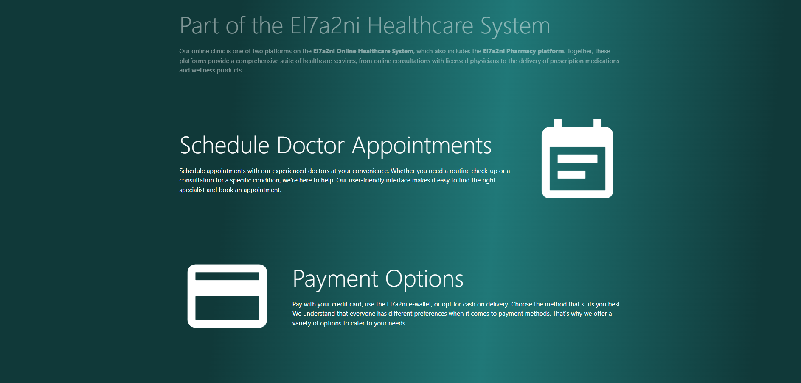
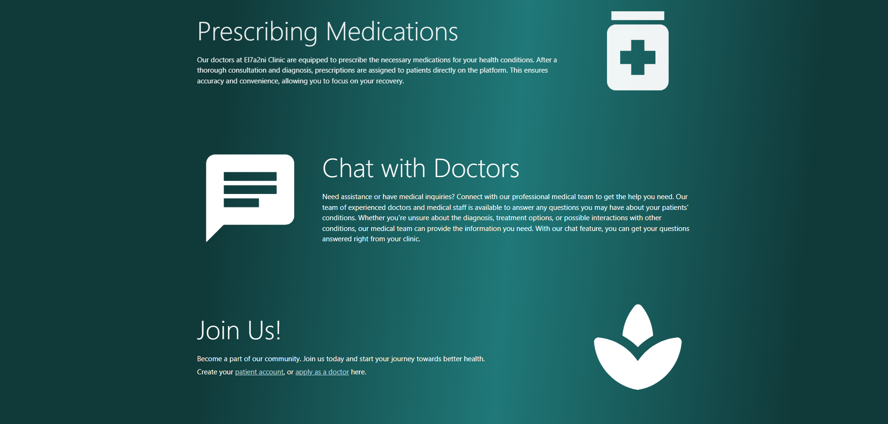

</details>

<details>
<summary>Patient login</summary>


</details>

<details>
<summary>Patient dashboard</summary>

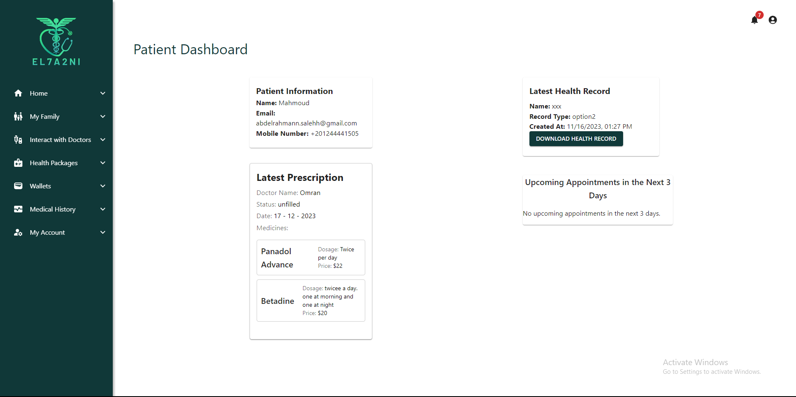

</details>

<details>
<summary>Book an appointment</summary>

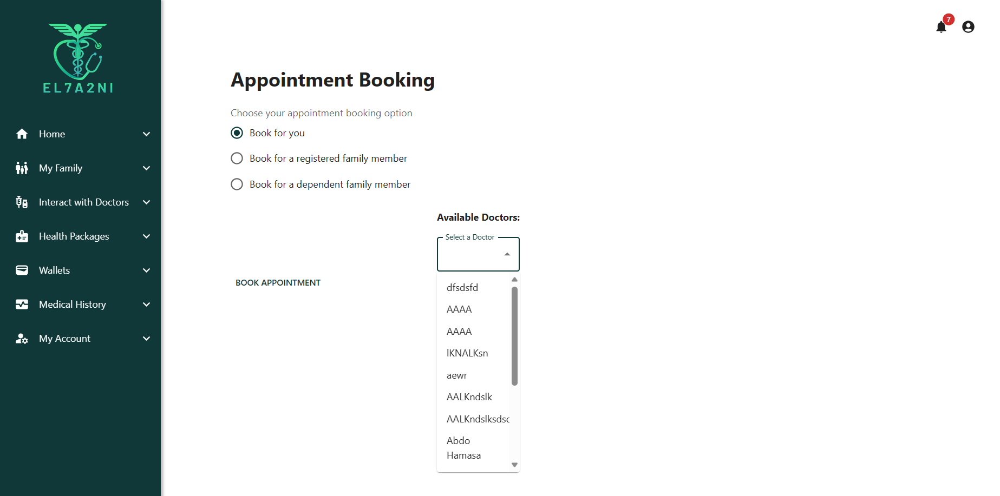

</details>

<details>
<summary>View the appointment</summary>

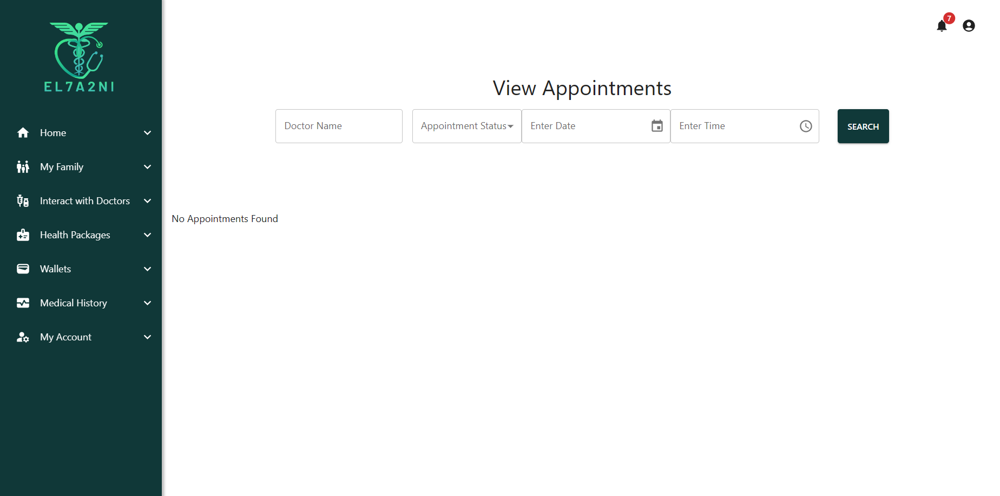

</details>

<details>
<summary>Request a follow up</summary>


</details>

<details>
<summary>View all doctors</summary>

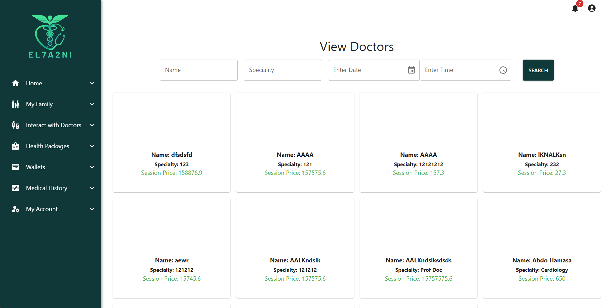

</details>

<details>
<summary>My doctors</summary>

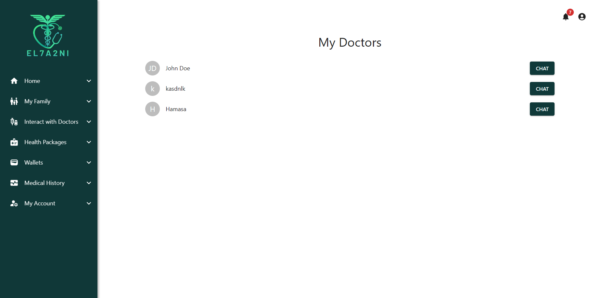

</details>

<details>
<summary>Chat with doctor</summary>

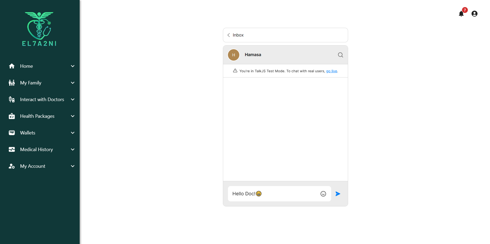

</details>

<details>
<summary>Family members</summary>

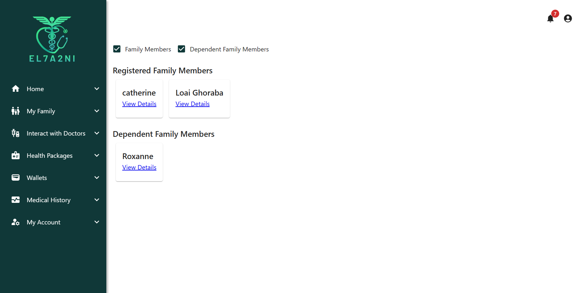

</details>

<details>
<summary>Family members details</summary>

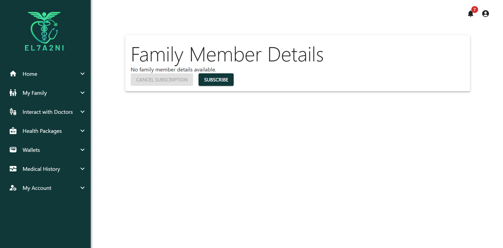

</details>

<details>
<summary>Add register family member</summary>

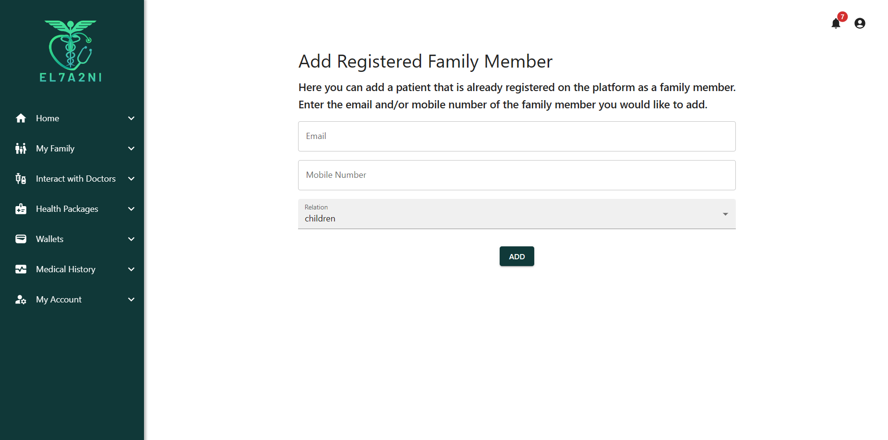

</details>

<details>
<summary>Wallet</summary>

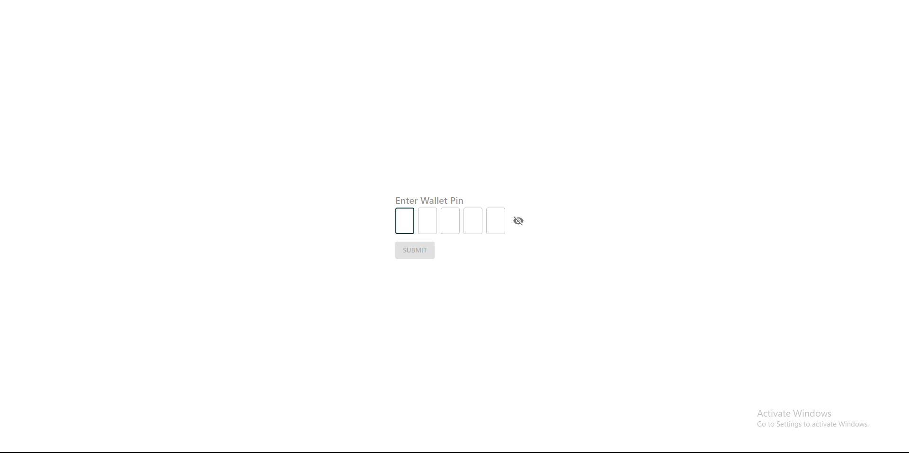

</details>

<details>
<summary>Doctor login</summary>


</details>

## Tech/Framework used

This software uses the `MERN` technology stack. Here is a more comprehensive list of used technologies in this software:

- [React](https://reactjs.org/)
- [Node.js](https://nodejs.org/en/)
- [Express](https://expressjs.com/)
- [MongoDB](https://www.mongodb.com/)
- [MongoDB Atlas](https://www.mongodb.com/cloud/atlas)
- [Mongoose](https://mongoosejs.com/)
- [Jira](https://www.atlassian.com/software/jira)
- [Firebase](https://firebase.google.com/)
- [Gmail API](https://developers.google.com/gmail/api/guides)
- [NodeMailer](https://nodemailer.com/about/)
- [Jest](https://jestjs.io/)
- [Material-UI](https://material-ui.com/)
- [Stripe](https://stripe.com/)
- [Stripe Elements](https://stripe.com/payments/elements)
- [Typescript](https://www.typescriptlang.org/)
- [Git](https://git-scm.com/)
- [Postman](https://www.postman.com/)
- [VSCode](https://code.visualstudio.com/)

## Features

The system has four user types: **_Guest_**, **_Patient_**, **_Doctor_** and **_Admin_**.

<details>

 <summary> Patient features </summary>

- **Account Management:**

  - Login, logout, change password, and reset forgotten password via email OTP.

- **Family Management:**

  - Link, view, add family members with details.

- **Doctor Interaction:**

  - View and interact with doctors (list, search, filter, select).
  - View doctor details.

- **Prescription Handling:**

  - View, filter, and select prescriptions.
  - Upload/remove medical documents.
  - Pay for appointments and health packages.

- **Appointment Management:**

  - View, filter, and select appointments.
  - Pay for appointments and health packages.

- **Health Records:**

  - View uploaded health records.

- **Health Package Subscription:**

  - Subscribe, view details, view status, and cancel subscriptions.

- **Wallet Management:**

  - View wallet balance.
  - Receive refunds.

- **Communication:**
  - Initiate/end video calls.
  - Engage in a chat with doctors.

</details>

<details>

 <summary> Doctors features </summary>

- **Account Management:**

  - Login, logout, change password, and reset forgotten password via email OTP.

- **Profile Management:**

  - Edit/update profile details.

- **Patient Interaction:**

  - View patient information, patient list, and search/filter patients.
  - Select and manage patients.

- **Appointment Handling:**

  - View, receive notifications, reschedule, and cancel appointments.
  - Filter and manage appointments.

- **Time Slot Management:**

  - Add, view, and delete available time slots.

- **Health Records:**

  - Access uploaded health records.

- **Wallet and Prescription Management:**
  - View wallet balance, prescriptions, and manage prescriptions.
  - Initiate/end video calls and chat with patients.

</details>

<details>

 <summary> Admin features </summary>

- **Account Management:**

  - Login, logout, change password, and reset forgotten password via email OTP.

- **Admin Management:**

  - Add another admin with a set username and password.
  - Remove user accounts (doctor, patient, or admin) from the system.

- **Information Handling:**

  - View uploaded information submitted by doctors for platform entry.

- **Health Package Management:**

  - Manage health packages: add, update, or delete with different price ranges (silver, gold, platinum).

- **Doctor Join Requests:**
  - Accept or reject doctor join requests to join the platform.

</details>

<details>

<summary> Guest features </summary>

- Sign up as a patient.
- Submit a registration request as a doctor and go through a registration process.

</details>

## Code Examples

<details>
    <summary>
    Forget Password Controller
    </summary>

```typescript
export const resetPasswordRequestHandler = async (req: Request, res: Response) => {
  const { email } = req.body;
  if (!email) return res.status(StatusCodes.BAD_REQUEST).json({ error: "Email is required" });
  try {
    const userData = await sendPasswordResetOTPIfUserExists(email);
    console.log(userData);
    res.status(StatusCodes.OK).json(userData);
  } catch (error: any) {
    return res.status(StatusCodes.BAD_REQUEST).json({ message: error.message });
  }
};

export const deletePasswordResetInfoHandler = async (req: Request, res: Response) => {
  const { email } = req.body;
  if (!email) return res.status(StatusCodes.BAD_REQUEST).json({ error: "Email is required" });
  try {
    const user = await findUserByEmail(email);
    await deletePasswordResetInfo(user);
    res.status(StatusCodes.OK).json({ message: "Password reset info deleted successfully" });
  } catch (error: any) {
    return res.status(StatusCodes.BAD_REQUEST).json({ message: error.message });
  }
};

export const validateOTPHandler = async (req: Request, res: Response) => {
  const { userData, otp } = req.body;
  if (!userData || !otp)
    return res.status(StatusCodes.BAD_REQUEST).json({ error: "UserData and OTP are required" });
  try {
    const user = await validateOTP(userData, otp);
    const passwordResetToken = signAndGetPasswordResetToken({
      id: user._id,
      role: userData.role
    } as User);
    res.cookie("passwordResetToken", passwordResetToken, {
      httpOnly: true,
      expires: user.passwordReset?.expiryDate
    });
    res.status(StatusCodes.OK).json({ message: "Password reset OTP is correct" });
  } catch (error: any) {
    return res.status(StatusCodes.BAD_REQUEST).json({ message: error.message });
  }
};

export const resetPasswordHandler = async (req: Request, res: Response) => {
  const { password, confirmPassword } = req.body;
  if (!password || !confirmPassword)
    res
      .status(StatusCodes.BAD_REQUEST)
      .json({ error: "Both Password and Confirm password is required" });
  if (password !== confirmPassword)
    res
      .status(StatusCodes.BAD_REQUEST)
      .json({ error: "Password and Confirm password must be same" });
  try {
    const { passwordResetToken } = req.cookies;
    if (!passwordResetToken) throw new Error("Password reset token not found");
    const userData = verifyAndDecodePasswordResetToken(passwordResetToken);
    await updatePassword(userData, password);
    res.clearCookie("passwordResetToken", { httpOnly: true });
    res.status(StatusCodes.OK).json({ message: "Password reset successfully" });
  } catch (error: any) {
    return res.status(StatusCodes.BAD_REQUEST).json({ message: error.message });
  }
};
```

</details>

<details>
    <summary>
    Doctor Add Patient Health Record
    </summary>

```typescript
export const doctorAddPatientHealthRecord = async (req: AuthorizedRequest, res: Response) => {
  if (!req.user?.id) return res.status(StatusCodes.BAD_REQUEST).send("User id is null");
  const healthRecordAttributes = ["url", "fileType", "recordType", "createdAt"];
  if (!req.params.patientId || !allAttributesExist(healthRecordAttributes, Object.keys(req.body)))
    return res.status(StatusCodes.BAD_REQUEST).send("Attributes missing");

  try {
    res.status(StatusCodes.OK).json(await addHealthRecord(req.params.patientId, req.body));
  } catch (err) {
    res.status(StatusCodes.BAD_REQUEST).send(err);
  }
};
```

</details>

<details>
    <summary>
    Get Doctor Application Data
    </summary>

```typescript
const getDoctorRegistrationRequest = async (req: Request, res: Response) => {
  const email = req.params.email;
  try {
    const request = await findDoctorRegistrationRequestByEmail(email);

    if (!request) {
      return res
        .status(StatusCodes.NOT_FOUND)
        .json({ message: "Doctor registration request not found" });
    }

    res.json(request);
  } catch (error) {
    console.error("Error fetching doctor registration request:", error);
    res.status(StatusCodes.INTERNAL_SERVER_ERROR).json({ message: "Internal Server Error" });
  }
};

export const getDoctorRegistrationRequestById = async (req: Request, res: Response) => {
  const doctorId = req.params.doctorId;
  try {
    const request = await findDoctorRegistrationRequestById(doctorId);
    if (!request) {
      return res
        .status(StatusCodes.NOT_FOUND)
        .json({ message: "Doctor registration request not found" });
    }
    res.json(request);
  } catch (error) {
    console.error("Error fetching doctor registration request:", error);
    res.status(StatusCodes.INTERNAL_SERVER_ERROR).json({ message: "Internal Server Error" });
  }
};

export default getDoctorRegistrationRequest;
```

</details>

<details>
    <summary>
    Subscribe to Health Package
    </summary>

```typescript
export const subscribeToHealthPackage = async (req: AuthorizedRequest, res: Response) => {
  const packageId = req.params.packageId;
  const patientId = req.user?.id!;
  const paymentMethod =
    req.query?.paymentMethod === "wallet" ? PaymentMethod.WALLET : PaymentMethod.CREDIT_CARD;
  try {
    await subscribeToHealthPackageService(patientId, patientId, packageId, paymentMethod);
    res.status(200).json({ message: "Subscription added successfully" });
  } catch (error: any) {
    console.error("Error subscribing to health package:", error);
    res.status(400).json({ message: error.message });
  }
};
```

</details>

<details>
    <summary>
    Medical History Page
    </summary>

```typescript
export interface IHealthRecord {
  name: string;
  url: string;
  createdAt: string | Date;
  recordType: string;
  fileType?: string;
}
const MedicalHistory: React.FC = () => {
  const [files, setFiles] = useState<Array<IHealthRecord>>([]);
  const [tableLoading, setTableLoading] = useState(true);
  const [deleteLoading, setDeleteLoading] = useState(false);
  const [upload, setUpload] = useState(false);
  const [selected, setSelected] = useState<readonly number[]>([]);
  const [viewFileModal, setViewFileModal] = useState(false);
  const [fileType, setFileType] = useState<string>();
  const [viewFileUrl, setViewFileUrl] = useState<string>();
  const [viewFileName, setViewFileName] = useState<string>();

  useEffect(() => {
    getAllFiles();
  }, []);

  const getAllFiles = () => {
    try {
      axios.get(`${config.serverUri}/patients/health-records`).then((res) => {
        setFiles(res.data);
        setTableLoading(false);
      });
    } catch (error) {}
  };

  const addFileToTable = async (healthrecord?: IHealthRecord) => {
    if (healthrecord)
      setFiles((old) => {
        return [...old, healthrecord];
      });
    setUpload(false);
  };

  const downloadFile = async (url: string, fileName: string) => {
    const response = await fetch(url, { mode: "cors" });
    const blob = await response.blob();
    saveAs(blob, fileName);
  };

  const deleteFile = async (fileUrl: string, index: number) => {
    //setDeleteLoading(true)
    const refd = ref(storage, fileUrl);
    try {
      await deleteObject(refd);
      await axios.delete(`${config.serverUri}/patients/health-records`, {
        params: { fileUrl: fileUrl }
      });
      setFiles((oldFiles) => {
        return [...oldFiles.slice(0, index), ...oldFiles.slice(index + 1)];
      });
    } catch (error) {
      console.log(error);
    }
    //setDeleteLoading(false)
  };

  const openViewFileModal = (file: IHealthRecord) => {
    setViewFileName(file.name);
    setViewFileUrl(file.url);
    setViewFileModal(true);
  };

  return (
    <Stack position="relative" direction="row" justifyContent="center" sx={{ width: "100%" }}>
      {upload && <UploadHealthRecordModal openUpload={true} close={addFileToTable} />}
      <Paper sx={{ mb: 2, width: "80%" }}>
        <EnhancedTableToolbar
          numSelected={selected.length}
          openModal={() => {
            setUpload(true);
          }}
        />
        <TableContainer>
          {/* <Box
            component="img"
            className="my-img"
            alt="The house from the offer."
            src={image}
            /> */}
          <Table sx={{ minWidth: 750 }} aria-labelledby="tableTitle" size={"medium"}>
            <TableHead sx={{ backgroundColor: "#103939", color: "white" }}>
              <TableRow>
                <TableCell sx={{ color: "white" }}>File Name</TableCell>
                <TableCell sx={{ color: "white" }} align="center">
                  Health Record Type
                </TableCell>
                <TableCell sx={{ color: "white" }} align="center">
                  File Type
                </TableCell>
                <TableCell sx={{ color: "white" }} align="center">
                  Upload Date
                </TableCell>
                <TableCell sx={{ color: "white" }} id="options" align="right"></TableCell>
              </TableRow>
            </TableHead>
            <TableBody>
              {tableLoading ? (
                <TableLoadingSkeleton />
              ) : (
                files?.map((file, index) => (
                  <TableRow
                    role="checkbox"
                    hover
                    onClick={() => openViewFileModal(file)}
                    tabIndex={-1}
                    key={index}
                    sx={{
                      "&.Mui-selected, &.Mui-selected:hover": {
                        backgroundColor: "#1039394D", // Change this to your desired color
                        cursor: "pointer"
                      }
                    }}
                  >
                    <TableCell id={"enhanced-table-checkbox-" + index} scope="row">
                      {file.name}
                    </TableCell>
                    <TableCell align="center">{file.recordType}</TableCell>
                    <TableCell align="center">{file.fileType}</TableCell>
                    <TableCell align="center">{new Date(file.createdAt).toDateString()}</TableCell>
                    <TableCell>
                      <Stack
                        direction="row"
                        justifyContent="center"
                        divider={<Divider orientation="vertical" flexItem />}
                        spacing={2}
                      >
                        <IconButton
                          onClick={(e) => {
                            e.stopPropagation();
                            downloadFile(file.url, file.name);
                          }}
                        >
                          <DownloadIcon color="action" sx={{ color: "#103939" }} />
                        </IconButton>
                        <IconButton
                          onClick={(e) => {
                            e.stopPropagation();
                            deleteFile(file.url, index);
                          }}
                        >
                          {deleteLoading ? <CircularProgress size={24} /> : <DeleteIcon />}
                        </IconButton>
                      </Stack>
                    </TableCell>
                  </TableRow>
                ))
              )}
            </TableBody>
          </Table>
        </TableContainer>
      </Paper>
      <Modal
        open={viewFileModal}
        onClose={() => {
          setViewFileModal(false);
        }}
        aria-labelledby="modal-modal-title"
        aria-describedby="modal-modal-description"
      >
        <Box sx={FileViewModalStyle}>
          <Typography
            align="center"
            color="#103939"
            fontFamily="Inter"
            id="modal-modal-title"
            variant="h6"
            component="h2"
          >
            {viewFileName}
          </Typography>
          <iframe width="500px" height="400px" src={viewFileUrl}></iframe>
        </Box>
      </Modal>
    </Stack>
  );
};
export default MedicalHistory;
```

</details>

<details>
    <summary>
    Follow-up Appointment Services
    </summary>

```typescript
export const findFollowUpRequestForRegisteredPatientById = async (
  followUpAppointmentRequestId: string
) => {
  return await FollowUpAppointmentRequestForRegistered.findById(followUpAppointmentRequestId);
};

export const getFollowUpRequestsForRegisteredPatient = async (patientId: string) => {
  return await FollowUpAppointmentRequestForRegistered.find({
    patientId
  });
};

export const createFollowUpRequestForRegisteredPatient = async (
  request: IFollowUpAppointmentRequestForRegisteredPatient
) => {
  const followUpAppointmentRequest = new FollowUpAppointmentRequestForRegistered(request);
  await followUpAppointmentRequest.save();
};

export const rejectFollowUpRequestForRegisteredPatient = async (
  followUpAppointmentRequestId: string
) => {
  const followUpAppointmentRequest = await findFollowUpRequestForRegisteredPatientById(
    followUpAppointmentRequestId
  );
  if (!followUpAppointmentRequest) {
    throw new Error("Follow up appointment request not found");
  }
  followUpAppointmentRequest.status = "rejected";
  await followUpAppointmentRequest.save();
};

export const acceptFollowUpRequestForRegisteredPatient = async (
  followUpAppointmentRequestId: string,
  appointmentTimePeriod?: TimePeriod
) => {
  const followUpAppointmentRequest = await findFollowUpRequestForRegisteredPatientById(
    followUpAppointmentRequestId
  );
  if (!followUpAppointmentRequest) {
    throw new Error("Follow up appointment request not found");
  }
  await scheduleAFollowUpAppointment(
    followUpAppointmentRequest.doctorId.toString(),
    followUpAppointmentRequest.patientId.toString(),
    (followUpAppointmentRequest.timePeriod || appointmentTimePeriod)!
  );
  followUpAppointmentRequest.status = "accepted";
  await followUpAppointmentRequest.save();
};

const scheduleAFollowUpAppointment = async (
  doctorId: string,
  patientId: string,
  timePeriod: TimePeriod
) => {
  const startTime = timePeriod.startTime.toString();
  const endTime = timePeriod.endTime.toString();
  await validateAppointmentCreation(patientId, doctorId, startTime, endTime, UserRole.DOCTOR);

  const initialAppointment = await findMostRecentCompletedAppointment(doctorId, patientId);
  if (!initialAppointment || initialAppointment.status !== "completed") {
    throw new Error("No recent completed appointment found between the doctor and patient");
  }
  await saveAppointment(doctorId, patientId, startTime, endTime, true);
};
```

</details>

<details>
    <summary>
    Patient Database Schema (Mongoose)
    </summary>

```typescript
import mongoose, { Document, Schema } from "mongoose";
import isEmail from "validator/lib/isEmail";
import isMobileNumber from "validator/lib/isMobilePhone";
import { IPatient } from "./interfaces/IPatient";
import PasswordResetSchema from "../users/PasswordReset";
import WalletSchema from "../wallets/Wallet";
import bcrypt from "bcrypt";
import NotificationSchema from "../notifications/Notification";

enum Relation {
  WIFE = "wife",
  HUSBAND = "husband",
  CHILD = "children"
}

export interface IPatientModel extends IPatient, Document {}

export const PatientSchema = new Schema<IPatientModel>(
  {
    username: { type: String, required: true, unique: true, index: true },
    password: { type: String, required: true, select: false, bcrypt: true },
    email: {
      type: String,
      validate: [isEmail, "invalid email"],
      unique: true,
      index: true
    },
    name: { type: String, required: true },
    dateOfBirth: { type: Date, required: true },
    gender: { type: String, required: true, enum: ["male", "female"] },
    mobileNumber: { type: String, required: true },
    emergencyContact: {
      fullname: { type: String, required: true },
      mobileNumber: {
        type: String,
        required: true,
        validate: [isMobileNumber, "invalid mobile number"]
      },
      relationToPatient: { type: String, required: true }
    },

    deliveryAddresses: { type: Array<{ type: String }>, select: false },
    imageUrl: String,
    healthRecords: {
      type: Array<{
        type: {
          name: { type: String; required: true };
          url: { type: String; required: true };
          recordType: { type: String; required: true };
          fileType: { type: String; required: true };
          createdAt: { type: Date; immutable: true };
        };
      }>,
      required: false
    },
    subscribedPackage: {
      type: {
        packageId: {
          type: Schema.Types.ObjectId,
          ref: "HealthPackage",
          required: true
        },
        startDate: { type: Date, required: true },
        endDate: { type: Date, required: true },
        status: {
          type: String,
          enum: ["subscribed", "unsubscribed", "cancelled"],
          required: true
        }
      },
      required: false,
      select: false
    },
    dependentFamilyMembers: {
      type: [
        {
          name: { type: String, required: true },
          nationalId: { type: String, required: true, unique: true },
          dateOfBirth: { type: Date, required: true },
          gender: { type: String, enum: ["male", "female"], required: true },
          relation: {
            type: String,
            enum: Relation,
            required: true
          },
          subscribedPackage: {
            type: {
              packageId: {
                type: Schema.Types.ObjectId,
                ref: "HealthPackage",
                required: true
              },
              startDate: { type: Date, required: true },
              endDate: { type: Date, required: true },
              status: {
                type: ["subscribed", "unsubscribed", "cancelled"],
                required: true
              }
            },
            required: false
          },
          healthRecords: {
            type: Array<{
              type: {
                name: { type: String; required: true };
                url: { type: String; required: true };
                recordType: { type: String; required: true };
                fileType: { type: String; required: true };
                createdAt: { type: Date; immutable: true };
              };
            }>,
            required: false
          }
        }
      ],
      required: false,
      select: false
    },
    registeredFamilyMembers: {
      type: [
        {
          id: {
            type: Schema.Types.ObjectId,
            ref: "Patient",
            required: true,
            unique: true
          },
          relation: { type: String, enum: Relation, required: true }
        }
      ],
      required: false,
      select: false
    },
    registeredFamilyMemberRequests: {
      type: [
        {
          id: {
            type: Schema.Types.ObjectId,
            ref: "Patient",
            required: true,
            unique: true
          },
          relation: { type: String, enum: Relation, required: true }
        }
      ],
      required: false,
      select: false
    },
    wallet: {
      type: WalletSchema,
      select: false,
      required: false
    },
    passwordReset: {
      type: PasswordResetSchema,
      select: false
    },
    receivedNotifications: {
      type: Array<typeof NotificationSchema>,
      select: false,
      required: false
    }
  },
  { timestamps: true }
);

PatientSchema.plugin(require("mongoose-bcrypt"), { rounds: 10 });

PatientSchema.methods.verifyPasswordResetOtp = function (otp: string) {
  return bcrypt.compare(otp, this.passwordReset.otp);
};
PatientSchema.methods.verifyWalletPinCode = function (pinCode: string) {
  return bcrypt.compare(pinCode, this.wallet.pinCode);
};

PatientSchema.virtual("age").get(function () {
  let today = new Date();
  let birthDate: Date = this.dateOfBirth;
  let age = today.getFullYear() - birthDate.getFullYear();
  let monthDifference = today.getMonth() - birthDate.getMonth();

  if (monthDifference < 0 || (monthDifference === 0 && today.getDate() < birthDate.getDate())) {
    age--;
  }
  return age;
});

export default mongoose.model<IPatientModel>("Patient", PatientSchema);
export { Relation };
```

</details>

## Installation

To install the project with `npm`, run the following commands in order.

```bash
> git clone https://github.com/advanced-computer-lab-2023/Code-of-Duty2-Clinic.git
> cd Code-of-Duty2-Clinic/
> cd server
> npm i
> cd ../client
> npm i
> cd ..
```

## API reference

Please refer to the `api-reference.md` file under the `docs` directory for a comprehensive understanding of the API’s capabilities and usage guidelines.

## Tests

Testing was done for this software using Postman.


## How to Use

Please follow the following steps to run and use this software.

### Set Environment Variables

To use this software, you must first add your environment variables.
To do so, you must create two `.env` files, one directly inside the `server/` folder and the other directly inside the `client/` folder.

In each of those directories, you will find a `.env.example` file. You must copy its content and paste in your newly created `.env` files respectively. You must then fill in the values needed for each environment variable, with guidance on how to do so provided in each `.env.example` file.

**Note:** Some (and only some) environment variables can be ignored for the sake of ease of setup at the cost of the operation of one or two features, such as the Stripe API environment variables which will just prevent the credit card payment feature from working, however the rest of the system will work just fine.

### Run the Backend

```bash
> cd server
> npm run dev
```

### Run the Frontend

```bash
> cd client
> npm run dev
```

### Access the client/server on the specified ports

The client and the server will be running on the ports specified in your `.env` files respectively.

## Authors

From the **Pharmacy** Team

- [@MoTammaa](https://github.com/MoTammaa)
- [@mahmoudaboueleneen](https://github.com/mahmoudaboueleneen)

From the **Clinic** Team

- [@AbdelrahmanRewaished](https://github.com/AbdelrahmanRewaished)
- [@abdelrahmanAbouelkheir](https://github.com/abdelrahmanAbouelkheir)
- [@omarhesham02](https://github.com/omarhesham02)
- [@ahmedmonsef184](https://github.com/ahmedmonsef184)
- [@OmarAhmedAdel](https://github.com/OmarAhmedAdel)
- [@Ahmedmandil44](https://github.com/Ahmedmandil44)

## Contribute

Contributions are always welcome!

See `CONTRIBUTING.md` for ways to get started. Please adhere to the `Code of Conduct` for this software outlined in said document.

## Credits

- Documentation
  - [ReactJs Documentation](https://react.dev/reference/react)
  - [Material UI Documentation](https://mui.com/material-ui/getting-started/)
- Tutorials
  - [React Stripe.js and the Payment Element](https://www.youtube.com/watch?v=e-whXipfRvg)
  - [React Tutorial for Beginners](https://www.youtube.com/watch?v=SqcY0GlETPk)
- Project Repositories
  - [Linear Depression Project Repository](https://github.com/Advanced-Computer-Lab-2022/Linear-Depression)

## License

This software currently has no license in place.
